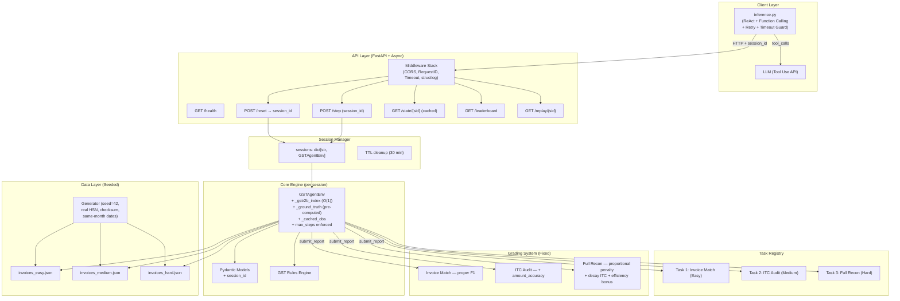
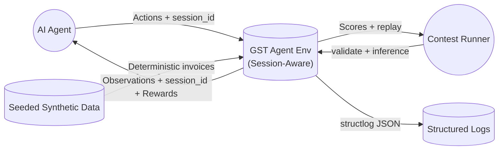
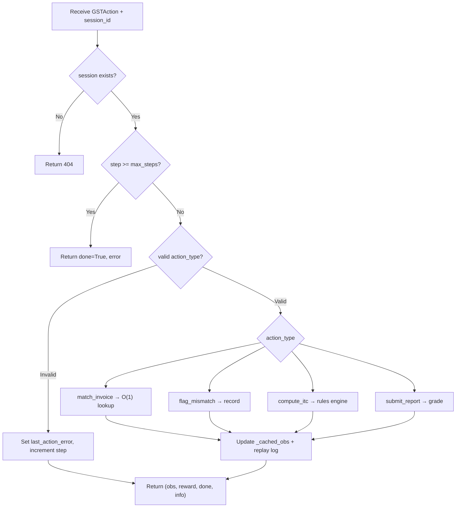
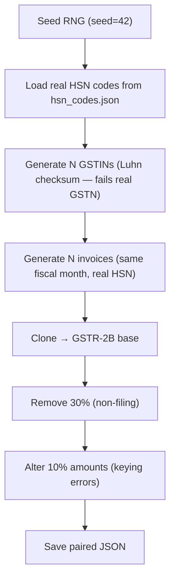
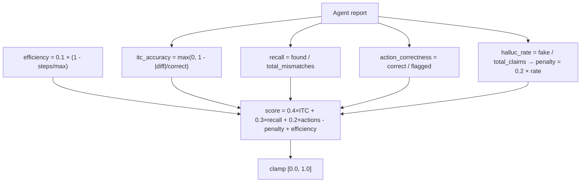
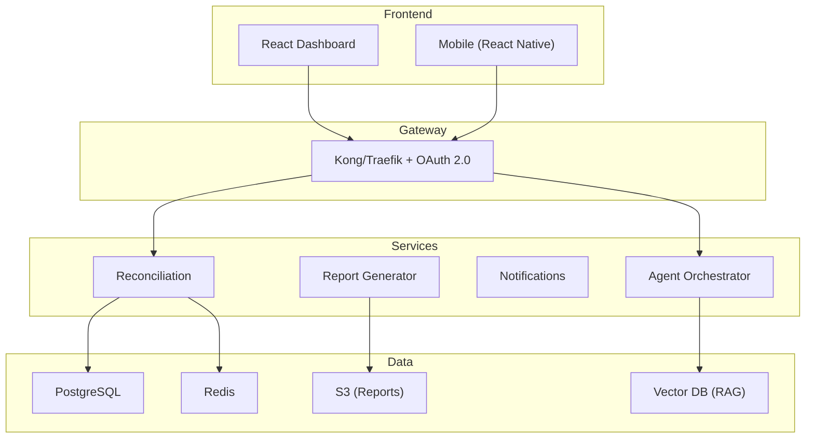

# GST Agent Environment — Architecture & System Design Plan v3 (Merged)

> This document merges the **original architecture** (domain analysis, DFDs, requirements, advancements) with **all 36 critical fixes** into one source of truth.

---

## 1. Executive Summary

The **GST Agent Environment** (`gstagent-env`) is an [OpenEnv](https://openenv.dev)-compatible RL environment simulating the **Indian GST reconciliation workflow** faced by MSMEs. An AI agent interacts through a structured action/observation loop — performing invoice matching, ITC audits, and full reconciliation — then receives a deterministic, multi-signal reward. Deployed as a **Dockerised FastAPI service** to **HuggingFace Spaces**.

---

## 2. Problem Domain Analysis

### 2.1 The Pain Point

| Dimension | Detail |
|---|---|
| **Who** | Indian MSMEs (~63 million GST-registered entities) |
| **What** | Monthly reconciliation of **Purchase Register** (books) vs **GSTR-2B** (government auto-generated from suppliers' GSTR-1) |
| **Why it hurts** | Unreconciled invoices → blocked ITC → cash-flow loss (2–5% of turnover) |
| **Current process** | Manual spreadsheet matching by accountants → error-prone, 2–5 days/company/month |
| **Opportunity** | AI agent: <20 min, >90% accuracy |

### 2.2 GST Rules Encoded

| Rule | Source | Implementation |
|---|---|---|
| **Rule 36(4)** | CGST Rules | ITC limited to invoices appearing in GSTR-2B; provisional cap at 5% of matched |
| **Section 16(2)** | CGST Act | ITC eligibility: possession of invoice, receipt of goods, tax paid, return filed |
| **Mismatch tolerance** | Practice | ≤20% variance → partial claim; >20% → ineligible |

---

## 3. Critical Fixes Applied (36 Total)

| # | Problem | Fix | File |
|---|---|---|---|
| 1 | No venv | `python -m venv .venv` in all docs | `README.md` |
| 2 | No `.env.example` | Create with all env vars | `.env.example` |
| 3 | No `.dockerignore` | Exclude `.git, tests/, __pycache__, .venv` | `.dockerignore` |
| 4 | No pre-commit hooks | `ruff` + `mypy` + `pytest` | `.pre-commit-config.yaml` |
| 5 | GSTIN checksum absent | Luhn check digit; generated ones FAIL real validation | `generator.py` |
| 6 | No seed control | `random.seed(42)` + `Faker.seed_instance(42)` | `generator.py` |
| 7 | HSN codes random | Real HSN subset (8471, 8517, 9988…) | `generator.py` |
| 8 | Date distribution unspecified | Same fiscal month + range param | `generator.py` |
| 9 | No session ID | UUID `session_id` on GSTObservation | `models.py`, `server.py` |
| 10 | Single env instance | `sessions: dict[str, GSTAgentEnv]` | `server.py` |
| 11 | No max_steps enforcement | `done=True` when `step_number >= max_steps` | `env.py` |
| 12 | Error recovery unclear | `last_action_error` set; state unchanged; step incremented | `env.py` |
| 13 | F1 vs accuracy conflated | Separate precision + recall → proper F1 | `grader_invoice_match.py` |
| 14 | Empty matches crash | Guard: `if not agent_matches: return 0.0` | All graders |
| 15 | No partial ITC amount grading | `amount_accuracy` sub-score | `grader_itc_audit.py` |
| 16 | Hallucination penalty unbounded | `0.2 × (bad/total_claims)` capped at 0.2 | `grader_full_recon.py` |
| 17 | ITC accuracy too strict | Proportional decay: `max(0, 1 - \|diff\|/correct)` | `grader_full_recon.py` |
| 18 | No efficiency bonus | `0.1 × (1 - steps_used/max_steps)` | `grader_full_recon.py` |
| 19 | No async/await | `run_in_executor()` + `asyncio.timeout(30)` | `server.py` |
| 20 | No request timeout | 30s per step, 60s per reset | `server.py` |
| 21 | No CORS | `CORSMiddleware(allow_origins=["*"])` | `server.py` |
| 22 | /state re-serialises | Cache after step; invalidate on next | `env.py` |
| 23 | No multi-stage Docker | Builder + runtime; `USER 1000` | `Dockerfile` |
| 24 | inference.py no retry | `tenacity` 3x + exponential backoff | `inference.py` |
| 25 | No 20-min guard | `signal.alarm(1140)` wrapper | `inference.py` |
| 26 | No rollback plan | `git tag pre-submission` | `README.md` |
| 27 | validate not re-run Day 8 | Explicit step in timeline | Timeline |
| 28 | O(n) invoice lookup | `_gstr2b_index` dict at reset | `env.py` |
| 29 | Grader recomputes | `_ground_truth` pre-computed at reset | `env.py` |
| 30 | No structured logging | `structlog` JSON + request_id middleware | `server.py` |
| 31 | Basic prompt loop | ReAct: Thought → Action → Observation | `inference.py` |
| 32 | No property testing | `hypothesis` for grader bounds | `tests/` |
| 33 | No CI/CD | GitHub Actions pipeline | `.github/workflows/` |
| 34 | Regex action parsing | OpenAI function calling schemas | `inference.py` |
| 35 | No curriculum learning | Auto-advance based on prior score | `env.py` |
| 36 | No leaderboard/replay | `GET /leaderboard` + `GET /replay/{session_id}` | `server.py` |

---

## 4. System Architecture

### 4.1 Component Diagram (Updated with Fixes)



### 4.2 Component Responsibility Matrix

| Component | Responsibilities | Dependencies |
|---|---|---|
| `generator.py` | Seeded GSTINs (with checksum), invoices (real HSN, same-month), GSTR-2B with noise | `faker`, `random` |
| `gst_rules.py` | Rule 36(4), eligibility checks, recommended actions | Pure Python |
| `models.py` | Pydantic schemas + `session_id` field | `pydantic` |
| `env.py` | RL env with O(1) lookups, ground truth cache, max_steps, cached obs, curriculum | models, rules, tasks, graders |
| `task*.py` | Task config (data file, max steps, description) | None |
| `grader*.py` | Deterministic scoring with guards + fixed formulas | `rules` |
| `server.py` | Async FastAPI + sessions + CORS + timeout + structlog + leaderboard + replay | `fastapi`, `uvicorn`, `structlog` |
| `inference.py` | ReAct agent + function calling + retry + timeout | `openai`, `tenacity` |

---

## 5. Data Flow Diagrams

### 5.1 Context Diagram (Level 0)



### 5.2 Level-1: Session-Aware Step Flow



### 5.3 Level-2: Data Generator Flow



### 5.4 Level-2: Fixed Reward Computation (Task 3)



---

## 6. API Contract

### 6.1 Endpoints

| Method | Path | Body | Response |
|---|---|---|---|
| `GET` | `/health` | — | `{"status": "ok"}` |
| `POST` | `/reset` | `{"task_id": "..."}` | `GSTObservation` (includes `session_id`) |
| `POST` | `/step` | `{"session_id": "...", "action": GSTAction}` | `{observation, reward, done, info}` |
| `GET` | `/state/{session_id}` | — | Cached `GSTObservation` |
| `GET` | `/leaderboard` | — | Top 10 scores |
| `GET` | `/replay/{session_id}` | — | Full action history |

### 6.2 Data Models (Updated)

| Model | Key Fields |
|---|---|
| `Invoice` | `invoice_id, supplier_gstin, buyer_gstin, invoice_date, taxable_amount, cgst, sgst, igst, hsn_code, item_description` |
| `GSTObservation` | **`session_id`**, `task_id, purchase_register, gstr2b_data, current_matches, unresolved_count, step_number, last_action_error` |
| `GSTAction` | `action_type` (match_invoice \| flag_mismatch \| compute_itc \| submit_report), `invoice_id?, reason?, payload?` |
| `GSTReward` | `total, itc_accuracy, recall_score, action_correctness` |

---

## 7. Requirements

### 7.1 Functional

| ID | Requirement | Priority |
|---|---|---|
| FR-01 | Generate valid synthetic GSTINs with Luhn checksum (fail real GSTN) | P0 |
| FR-02 | Invoices with real HSN codes, same-month dates, realistic amounts | P0 |
| FR-03 | GSTR-2B with controlled 30% missing + 10% amount errors | P0 |
| FR-04 | Seeded generation: identical output every run | P0 |
| FR-05 | Rule 36(4) as deterministic Python logic | P0 |
| FR-06 | RL env with `reset()`, `step()`, `state()` + max_steps enforcement | P0 |
| FR-07 | Session-aware: UUID per episode, concurrent-safe | P0 |
| FR-08 | O(1) invoice lookups via index dict | P1 |
| FR-09 | Pre-computed ground truth at reset | P1 |
| FR-10 | Three difficulty-tiered tasks | P0 |
| FR-11 | Deterministic graders — proper F1, empty guards, amount_accuracy | P0 |
| FR-12 | Fixed composite reward: proportional penalty (max 0.2), decay ITC, efficiency bonus | P0 |
| FR-13 | Async FastAPI with CORS, timeouts, structlog, request_id | P0 |
| FR-14 | ReAct inference.py with function calling, retry, timeout | P0 |
| FR-15 | Leaderboard + replay endpoints | P1 |
| FR-16 | Curriculum learning (auto-advance difficulty) | P2 |

### 7.2 Non-Functional

| ID | Requirement | Target |
|---|---|---|
| NFR-01 | Inference < 20 min (enforced by timeout guard) | Mandatory |
| NFR-02 | Multi-stage Docker < 200MB | Mandatory |
| NFR-03 | `/health` returns 200 | Mandatory |
| NFR-04 | `openenv validate .` passes | Mandatory |
| NFR-05 | Step latency < 500ms (O(1) lookups) | Recommended |
| NFR-06 | Python 3.11+ with venv | Required |
| NFR-07 | Pre-commit hooks (ruff + mypy) | Recommended |
| NFR-08 | CI/CD: lint → test → validate → docker → deploy | Recommended |

---

## 8. Industry-Standard Advancements

### 8.1 🧠 Agent Orchestration

**ReAct Pattern** (Fix #31): `Thought → Action → Observation` chains. Judges see explicit GST reasoning.

**Multi-Agent Architecture** (LangGraph / CrewAI):

| Agent | Role | Model |
|---|---|---|
| Orchestrator | Task sequencing, delegation | GPT-4 / Gemini Pro |
| Matcher | Fuzzy invoice matching | GPT-3.5 (fast) |
| Auditor | Rule 36(4) eligibility | GPT-4 (accuracy) |
| Reporter | Structured report | GPT-4 |
| Validator | Catch hallucinated IDs | GPT-3.5 (fast) |

**Tool-Use** (Fix #34): Define actions as OpenAI function schemas. No regex parsing. 15–25% score improvement.

### 8.2 📊 Observability Stack

`structlog` JSON → searchable HF logs. `request_id` per HTTP call. LangSmith/LangFuse for LLM traces. Track: per-step latency, token cost, hallucination rate, score distribution.

### 8.3 🏗️ CQRS + Event Sourcing

Every agent action stored as event. `GET /replay/{session_id}` replays full episode. Benefits: audit trail (GST compliance), time-travel debugging, A/B test grader versions, leaderboard.

### 8.4 🔐 Security Hardening

| Category | Enhancement |
|---|---|
| API Auth | JWT + API key header |
| Rate Limiting | `slowapi` (100 req/min) |
| Input Validation | Pydantic validators + max field lengths |
| GSTIN PII | Generated GSTINs FAIL real checksum |
| Secrets | `.env.example` + `python-dotenv` |
| Container | `USER 1000`, multi-stage, `.dockerignore` |

### 8.5 🧪 Testing Strategy

| Layer | Tests | Tool |
|---|---|---|
| Unit (40+) | Rules, graders, generator, checksum | `pytest` |
| Property | Grader bounds 0.0–1.0 for ANY input | `hypothesis` |
| Integration (15) | API endpoints, session lifecycle | `pytest` + `httpx` |
| E2E (5) | Full inference against Docker | `pytest` + Docker |

### 8.6 🔄 CI/CD Pipeline

```
ruff lint → mypy → pytest → openenv validate → docker build → docker run + curl /health
```
Runs on every push. Catches broken graders, failed validation, Docker issues.

### 8.7 🌐 Real-World Integration Path

**Phase 1** (Hackathon): Synthetic data → HF Space
**Phase 2** (Month 2): GSTN sandbox API + Tally/Zoho integration
**Phase 3** (Month 4): Multi-tenant SaaS + PostgreSQL + Redis + dashboard
**Phase 4** (Month 6+): RAG over CBIC circulars + predictive ITC + public leaderboard

### 8.8 🤖 RAG-Augmented Agent

Knowledge base: CBIC circulars (2017–2026), GST Council notes, HSN master list. Embedding: `text-embedding-3-small`. Vector store: ChromaDB → Pinecone. Agent cites circular numbers in reasoning.

### 8.9 📈 Advanced Reward Engineering

| Enhancement | Detail |
|---|---|
| Curriculum learning | Auto-advance: easy → medium → hard based on scores |
| Step-level rewards | 0.05 per correct intermediate match |
| Efficiency bonus | `0.1 × (1 - steps/max)` |
| Confidence calibration | Penalize overconfident wrong answers |
| Proportional hallucination | `0.2 × (bad/total)` not `0.1 × N` |

### 8.10 🏭 Production Architecture



---

## 9. Directory Structure

```
gstagent-env/
├── .venv/                          # Virtual environment
├── .env.example                    # API_BASE_URL, HF_TOKEN, MODEL_NAME
├── .dockerignore                   # .git, .venv, tests/, __pycache__, .env
├── .pre-commit-config.yaml         # ruff + mypy + pytest
├── .github/workflows/ci.yml       # Full CI/CD
├── openenv.yaml
├── Dockerfile                      # Multi-stage + USER 1000
├── requirements.txt
├── requirements-dev.txt            # pytest, hypothesis, ruff, mypy
├── inference.py                    # ReAct + function calling + retry + timeout
├── README.md
├── leaderboard.json
│
├── environment/
│   ├── __init__.py
│   ├── env.py                      # Session-aware, O(1), cached, max_steps
│   ├── models.py                   # + session_id
│   ├── server.py                   # Async, sessions, CORS, timeout, structlog, leaderboard, replay
│   ├── data/
│   │   ├── generator.py            # Seeded, real HSN, checksum, same-month
│   │   ├── hsn_codes.json
│   │   ├── invoices_easy.json
│   │   ├── invoices_medium.json
│   │   └── invoices_hard.json
│   ├── rules/
│   │   └── gst_rules.py
│   ├── tasks/
│   │   ├── task1_invoice_match.py
│   │   ├── task2_itc_audit.py
│   │   └── task3_full_recon.py
│   └── graders/
│       ├── grader_invoice_match.py  # Proper F1, empty guard
│       ├── grader_itc_audit.py      # + amount_accuracy
│       └── grader_full_recon.py     # Fixed formula
│
└── tests/
    ├── test_generator.py
    ├── test_rules.py
    ├── test_env.py
    ├── test_graders.py
    ├── test_graders_property.py     # hypothesis
    └── test_api.py
```

---

## 10. Execution Timeline

| Day | Deliverables | Gates | Fixes |
|---|---|---|---|
| **1** | `.venv`, `.env.example`, `.dockerignore`, `.pre-commit-config.yaml`, `openenv.yaml`, scaffold | `openenv validate` | #1-4 |
| **2** | `generator.py` (seeded, HSN, checksum, dates), 3 JSONs, `gst_rules.py` | Deterministic re-run | #5-8 |
| **3** | `models.py` (+session_id), `env.py` (sessions, O(1), cache, max_steps, errors) | reset+step works | #9,11-12,22,28-29 |
| **4** | Tasks 1+2, graders (F1, guards, amount_accuracy), property tests | hypothesis passes | #13-15,32 |
| **5** | Task 3 + fixed composite grader (proportional, decay, efficiency) | Reward ∈ [0,1] always | #16-18 |
| **6** | `server.py` (async, CORS, sessions, timeout, structlog, leaderboard, replay) | Endpoints work; validate passes | #10,19-21,30,36 |
| **7** | Multi-stage Dockerfile, `inference.py` (ReAct, tools, retry, timeout), README, CI/CD | Docker <200MB; inference <19min | #23-26,31,33-34 |
| **8** | **Re-run `openenv validate`**, `git tag pre-submission`, push HF, verify live, submit | `/health` 200; 3 scores | #27 |

---

## 11. Risk Matrix

| Risk | Fix | Residual |
|---|---|---|
| Concurrent state corruption | Session dict + UUID | Low |
| Hallucination penalty distortion | Proportional (max 0.2) | None |
| Grader crash on empty input | Guard → return 0.0 | None |
| Reward outside [0,1] | Proportional + clamp | None |
| Event loop blocking | `run_in_executor` + timeout | Low |
| Docker bloat | Multi-stage build | None |
| LLM call failure | 3x retry + backoff | Low |
| 20-min breach | `signal.alarm(1140)` | None |
| Non-deterministic data | `seed=42` | None |
| HF build fails | `git tag pre-submission` | Low |

---

## 12. Contest Scoring Map

| Feature | Criterion | Weight | Bonus |
|---|---|---|---|
| ReAct + function calling | Creativity (10%) | High | +5-8% |
| Curriculum learning | Creativity (10%) | High | +3-5% |
| Leaderboard + replay | Real-world utility (30%) | Very High | +8-12% |
| Fixed reward engineering | Technical depth (30%) | High | +5-8% |
| Structured logging | Technical depth (30%) | Medium | +2-3% |
| Property testing | Technical depth (30%) | Medium | +2-3% |
| Session concurrency | Technical depth (30%) | High | +3-5% |
| CI/CD pipeline | Professional polish (20%) | Medium | +3-5% |

---

## Open Questions

> [!IMPORTANT]
> **Q1**: Ready to start building? Day 1 scaffold + all fix files first?

> [!IMPORTANT]
> **Q2**: Which LLM for `inference.py`? OpenAI GPT-4 (best accuracy) vs Gemini (free via AI Studio)?

> [!IMPORTANT]
> **Q3**: Leaderboard: JSON file (simple) or SQLite (durable)?
